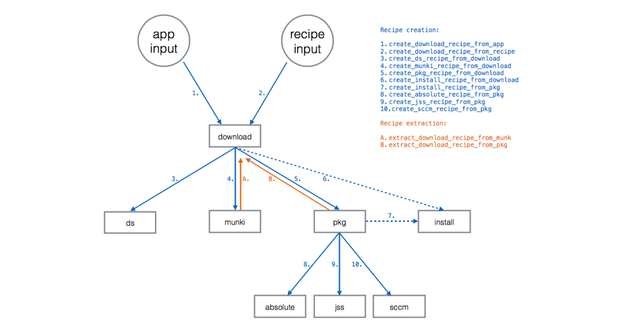
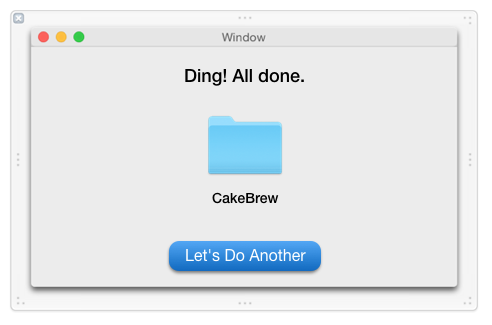

# Recipe Robot Development Notes

Some scattered notes to assist in the design and development of Recipe Robot.

<!-- MarkdownTOC autolink=true depth=4 bracket=round -->

- [Facts necessary to produce recipe types](#facts-necessary-to-produce-recipe-types)
- [Recipe creation functions](#recipe-creation-functions)
- [App interface](#app-interface)

<!-- /MarkdownTOC -->

## Facts necessary to produce recipe types

These are the pieces of information we'll need to collect from app and recipe input in order to create the corresponding recipe types.

This may be useful when we create the various Recipe classes and subclasses.

__Any recipe type__

- Required:
    - Recipe identifier (string)
    - Input (dict)
    - Input -> NAME (string)
    - Process (list)

- Optional or conditional:
    - MinimumVersion (string, probably "0.5.0" for our purposes)

__download__

- Required:
    - Process -> URLDownloader processor
    - Process -> EndOfCheckPhase processor, after the actual download occurs but before unarchiving or veriying code sig, and only if we need the recipe to be compatible with autopkg's `--check` argument

- Optional or conditional:
    - Input -> SPARKLE_FEED_URL (string), if using Sparkle
    - Input -> DOWNLOAD_URL (string), if using predictable URL
    - Process -> GitHubReleasesInfoProvider processor, if using GitHub releases
    - Input -> SOURCEFORGE_FILE_PATTERN (string), if using SourceForge releases
    - Input -> SOURCEFORGE_PROJECT_ID (string), if using SourceForge releases
    - Process > SourceForgeURLProvider processor, if using SourceForge releases

__munki__

- Required:
    - ParentRecipe (string, probably download or pkg recipe)
    - Input -> MUNKI_REPO_SUBDIR (string)
    - Input -> pkginfo (dict)
        - catalogs (array of strings)
        - description (string)
        - display_name (string)
        - name (string)
        - unattended_install (bool)
    - Process -> MunkiImporter processor

- Optional or conditional:
- Process -> MunkiPkginfoMerger processor, if there is additional pkginfo
    - Process -> DmgCreator processor, if parent recipe produces a zip
    - Copy process to get the icon file into the repo?
    - Path to icon in pkginfo?

__pkg__

- Required:
    - ParentRecipe (string, probably download recipe)
    - Input -> PKG_ID (string)
    - Process -> PkgRootCreator processor
    - Process -> Versioner processor
    - Process -> PkgCreator processor

- Optional or conditional:
    - Process -> Unarchiver processor, if parent recipe produces a zip
    - Process -> AppDmgVersioner processor, if parent recipe produces a dmg
    - Process -> Copier, if parent recipe doesn't produce the desired root file tree (e.g. app needs to be moved to /Applications)

__install__

- Required:
    - ParentRecipe (string, probably download or pkg recipe)

- Optional or conditional:
    - Process -> Unarchiver processor, if parent recipe produces a zip
    - Process -> DmgCreator processor, if parent recipe produces a zip
    - Process -> InstallFromDMG processor, if parent recipe produces a zip or a dmg
    - Process -> Installer processor, if parent recipe produces a pkg

__jss__

- Required:
    - ParentRecipe (string, pkg recipe)
    - Input -> prod_name (string), usually identical to NAME
    - Input -> category (string), limited to 8 choices by default
    - Input -> policy_category (string), usually "Testing"
    - Input -> policy_template (string), usually "PolicyTemplate.xml"
    - Input -> self_service_icon (string), usually ${NAME}.png
    - Input -> self_service_description (string), can be same as Munki recipe description
    - Input -> groups (array)
    - Input -> GROUP_NAME (string)
    - Input -> GROUP_TEMPLATE (string), usually "SmartGroupTemplate.xml"
    - Process -> JSSImporter processor
    - The jss-recipes repo must be added (for use of xml templates)
    - Icon png copied to same folder as recipe

- Optional or conditional:
    - Input -> jss_inventory_name (string), if prod_name and NAME differ
    - Input -> extension_attribute (string), if smart group requires the use of an extension attribute

__absolute__

- Required:
    - ParentRecipe (string, probably pkg recipe)
    - Process -> com.github.tburgin.AbsoluteManageExport/AbsoluteManageExport processor

__sccm__

- Required:
    - ParentRecipe (string, probably pkg recipe)
    - Process -> com.github.autopkg.cgerke-recipes.SharedProcessors/CmmacCreator processor

__ds__

- Required:
    - ParentRecipe (string, probably download or pkg recipe)
    - Input -> DS_PKGS_PATH (string)
    - Input -> DS_NAME (string)
    - Process -> StopProcessingIf processor
    - Process -> Copier processor

## Elliot's recipe template logic

Here's the logic I was using to create recipes manually until this point:

- The app has a Sparkle feed:
    - Downloaded file is zip, .tar.gz, etc:
        - App is signed:
            - SPARKLE ZIP SIGNED __DOWNLOAD__ RECIPE TEMPLATE:
                - SparkleUpdateInfoProvider
                - URLDownloader
                - EndOfCheckPhase
                - Unarchiver
                - CodeSignatureVerifier
            - SPARKLE ZIP SIGNED __MUNKI__ RECIPE TEMPLATE
                - DmgCreator
                - MunkiImporter
            - SPARKLE ZIP SIGNED __PKG__ RECIPE TEMPLATE
                - PkgCreator
            - SPARKLE ZIP SIGNED __INSTALL__ RECIPE TEMPLATE
                - DmgCreator
                - InstallFromDMG
        - App is unsigned:
            - SPARKLE ZIP UNSIGNED __DOWNLOAD__ RECIPE TEMPLATE:
                - SparkleUpdateInfoProvider
                - URLDownloader
                - EndOfCheckPhase
            - SPARKLE ZIP UNSIGNED __MUNKI__ RECIPE TEMPLATE:
                - Unarchiver
                - DmgCreator
                - MunkiImporter
            - SPARKLE ZIP UNSIGNED __PKG__ RECIPE TEMPLATE:
                - Unarchiver
                - PkgCreator
            - SPARKLE ZIP UNSIGNED __INSTALL__ RECIPE TEMPLATE:
                - Unarchiver
                - DmgCreator
                - InstallFromDMG
    - Downloaded file is dmg, iso:
        - App is signed:
            - SPARKLE DMG SIGNED __DOWNLOAD__ RECIPE TEMPLATE:
                - SparkleUpdateInfoProvider
                - URLDownloader
                - EndOfCheckPhase
                - CodeSignatureVerifier
            - SPARKLE DMG SIGNED __MUNKI__ RECIPE TEMPLATE
                - MunkiImporter
            - SPARKLE DMG SIGNED __PKG__ RECIPE TEMPLATE
                - PkgRootCreator
                - Copier
                - PkgCreator
            - SPARKLE DMG SIGNED __INSTALL__ RECIPE TEMPLATE
                - InstallFromDMG
        - App is unsigned:
            - SPARKLE DMG UNSIGNED __DOWNLOAD__ RECIPE TEMPLATE:
                - SparkleUpdateInfoProvider
                - URLDownloader
                - EndOfCheckPhase
            - SPARKLE DMG UNSIGNED __MUNKI__ RECIPE TEMPLATE
                - MunkiImporter
            - SPARKLE DMG UNSIGNED __PKG__ RECIPE TEMPLATE
                - PkgRootCreator
                - Copier
                - PkgCreator
            - SPARKLE DMG UNSIGNED __INSTALL__ RECIPE TEMPLATE
                - InstallFromDMG

## Recipe creation functions

Here's a map of the planned creation (blue) and extraction (orange) functions.

## App interface

Here's what we're thinking about for the app interface, for now:

1. Upon first launch, the user is prompted for two pieces of information:

    - preferred identifier
    - preferred formats

    The user can get back to this screen at any time by choosing Preferences from the Recipe Robot menu.

    

    &nbsp;

2. Upon saving the preferences (and upon each subsequent launch), main window appears, prompting the user to drag in a recipe or app.

    

    &nbsp;

3. Upon dragging an app on, Recipe Robot starts processing facts about the app:

    1. Are there any existing AutoPkg recipes for this app?
    2. Does the app have a Sparkle feed? Is it valid?
    3. Is the app hosted on GitHub or SourceForge?

    

    &nbsp;

4. After processing, Recipe Robot asks which recipes you'd like to create.

    Options for recipes that already exist based on autopkg search results will be dimmed.

    

    &nbsp;

5. Recipes are created by calling the Python scripts, and the resulting files are placed into a cache folder, which can be accessed by double-clicking.

    The proper recipe identifier and ParentRecipe chain are automatically added.

    
