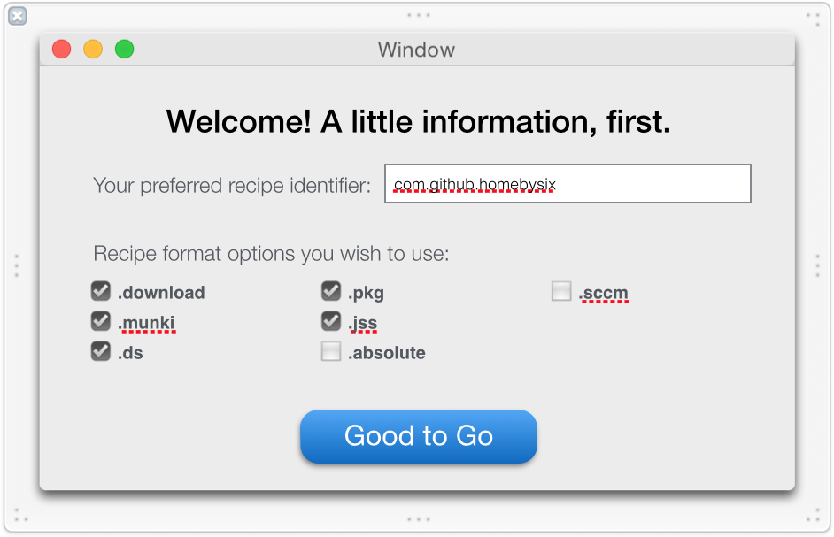
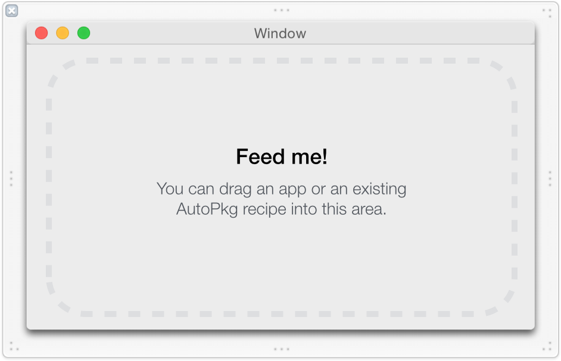
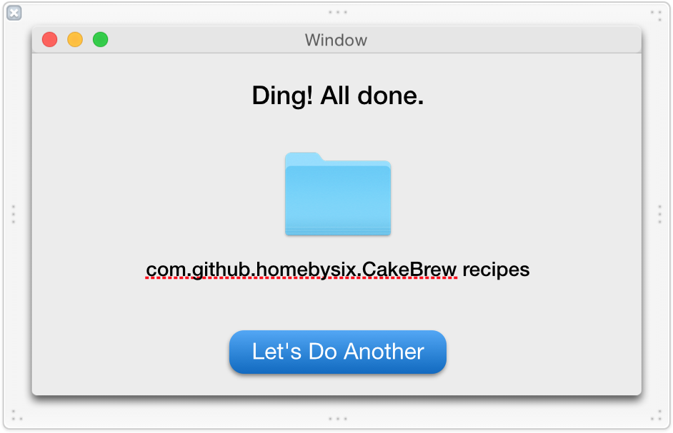

# Recipe Robot Development Notes

Some scattered notes to assist in the design and development of Recipe Robot.

<!-- MarkdownTOC autolink=true depth=4 bracket=round -->

- [Planned script workflow](#planned-script-workflow)
- [Facts necessary to produce recipe types](#facts-necessary-to-produce-recipe-types)
- [Interesting examples and edge cases to use for testing:](#interesting-examples-and-edge-cases-to-use-for-testing)
- [App interface](#app-interface)

<!-- /MarkdownTOC -->

## Planned script workflow

Script takes the following as input:

- Input path, which can be one of the following
    - Path to an app
    - Path to an existing AutoPkg recipe
    - GitHub URL
    - SourceForge URL
    - Sparkle feed URL
    - Direct download URL
    - Others?
- Desired recipe identifier (e.g. com.github.homebysix)
- Desired recipe types (e.g. download, munki, pkg, etc.)
- Desired recipe save location
- For DeployStudio recipes, path to DS packages

And produces the following as output:

- One recipe for each selected recipe type that doesn't already exist
- A plist with meta-information about the recipe creation process, including errors

## Facts necessary to produce recipe types

These are the pieces of information we'll need to collect from app and recipe input in order to create the corresponding recipe types.

This may be useful when we create the various Recipe classes and subclasses.

- app_name
- bundle_id
- description
- developer
- download_format
- download_url
- github_repo
- max_os_vers
- min_os_vers
- codesign_status
- codesign_reqs
- sourceforge_id
- sparkle_feed
- version_key

__Any recipe type__

- Required:
    - Recipe identifier (string)
    - Input (dict)
    - Input -> NAME (string)
    - Process (list)

- Optional or conditional:
    - MinimumVersion (string, probably "0.5.0", or whatever is contemporaneous with recipe-rebot's development.

__download__

- Required:
    - Process -> URLDownloader processor
    - Process -> EndOfCheckPhase processor, after the actual download occurs but before unarchiving or veriying code sig.

- Optional or conditional:
    - Input -> SPARKLE_FEED_URL (string), if using Sparkle
    - Input -> DOWNLOAD_URL (string), if using predictable URL
    - Process -> GitHubReleasesInfoProvider processor, if using GitHub releases
    - Input -> SOURCEFORGE_FILE_PATTERN (string), if using SourceForge releases
    - Input -> SOURCEFORGE_PROJECT_ID (string), if using SourceForge releases
    - Process > SourceForgeURLProvider processor, if using SourceForge releases

__munki__

- Required:
    - ParentRecipe (string, probably download or pkg recipe)
    - Input -> MUNKI_REPO_SUBDIR (string)
    - Input -> pkginfo (dict)
        - catalogs (array of strings)
        - description (string)
        - display_name (string)
        - name (string)
        - unattended_install (bool)
    - Process -> MunkiImporter processor

- Optional or conditional:
- Process -> MunkiPkginfoMerger processor, if there is additional pkginfo
    - Process -> DmgCreator processor, if parent recipe produces a zip
    - Copy process to get the icon file into the repo?
    - Path to icon in pkginfo?

__pkg__

- Required:
    - ParentRecipe (string, probably download recipe)
    - Input -> PKG_ID (string)
    - Process -> PkgRootCreator processor
    - Process -> Versioner processor
    - Process -> PkgCreator processor

- Optional or conditional:
    - Process -> Unarchiver processor, if parent recipe produces a zip
    - Process -> AppDmgVersioner processor, if parent recipe produces a dmg
    - Process -> Copier, if parent recipe doesn't produce the desired root file tree (e.g. app needs to be moved to /Applications)

__install__

- Required:
    - ParentRecipe (string, probably download or pkg recipe)

- Optional or conditional:
    - Process -> Unarchiver processor, if parent recipe produces a zip
    - Process -> DmgCreator processor, if parent recipe produces a zip
    - Process -> InstallFromDMG processor, if parent recipe produces a zip or a dmg
    - Process -> Installer processor, if parent recipe produces a pkg

__jss__

- Required:
    - ParentRecipe (string, pkg recipe)
    - Input -> prod_name (string), usually identical to NAME
    - Input -> category (string), limited to 8 choices by default
    - Input -> policy_category (string), usually "Testing"
    - Input -> policy_template (string), usually "PolicyTemplate.xml"
    - Input -> self_service_icon (string), usually ${NAME}.png
    - Input -> self_service_description (string), can be same as Munki recipe description
    - Input -> groups (array)
    - Input -> GROUP_NAME (string)
    - Input -> GROUP_TEMPLATE (string), usually "SmartGroupTemplate.xml"
    - Process -> JSSImporter processor
    - The jss-recipes repo must be added (for use of xml templates)
    - Icon png copied to same folder as recipe

- Optional or conditional:
    - Input -> jss_inventory_name (string), if prod_name and NAME differ
    - Input -> extension_attribute (string), if smart group requires the use of an extension attribute

__absolute__

- Required:
    - ParentRecipe (string, probably pkg recipe)
    - Process -> com.github.tburgin.AbsoluteManageExport/AbsoluteManageExport processor

__sccm__

- Required:
    - ParentRecipe (string, probably pkg recipe)
    - Process -> com.github.autopkg.cgerke-recipes.SharedProcessors/CmmacCreator processor

__ds__

- Required:
    - ParentRecipe (string, probably download or pkg recipe)
    - Input -> DS_PKGS_PATH (string)
    - Input -> DS_NAME (string)
    - Process -> StopProcessingIf processor
    - Process -> Copier processor

## Interesting examples and edge cases to use for testing:

Zip download reveals an installer in .app format:
```
recipe-robot -v http://download.bjango.com/skalacolor/
```

Sparkle feed blocks Python user-agent:
```
recipe-robot -v http://bohemiancoding.com/static/download/sketch.zip
```

Downloaded disk image requires agreement to license before mounting:
```
recipe-robot -v https://www.revisionsapp.com/downloads/revisions-2.1.1.dmg
```

Sparkle feed lists the most recent items last, instead of first:
```
recipe-robot -v http://www.marinersoftware.com/sparkle/MacGourmet4/macgourmet4.xml
```

Zip download reveals a pkg installer:
```
recipe-robot -v http://download.bjango.com/istatserver/
```

In addition, attempting to expand the iStat Server pkg results in an interesting error:
```
$ pkgutil --expand iStat\ Server.pkg expanded

pkgutil(489,0x7fff74f5e300) malloc: *** mach_vm_map(size=277076930199552) failed (error code=3)
*** error: can't allocate region
*** set a breakpoint in malloc_error_break to debug
Abort trap: 6
```

Dmg download reveals a pkg installer (and an uninstaller too):
```
recipe-robot --verbose http://downloads.econtechnologies.com/CS4_Download.dmg
```

Dmg download reveals a pkg installer, which contains an app:
```
recipe-robot --verbose --include-existing https://pqrs.org/osx/karabiner/files/Karabiner-10.9.0.dmg
recipe-robot --verbose https://github.com/integralpro/nosleep/releases
```

In addition, attempting to extract the app from the Karabiner or NoSleep pkg results in many errors like this:
```
pax: End of archive volume 1 reached
pax: Sorry, unable to determine archive format
```

App that uses a version 1 (obsolete) code signature:
```
recipe-robot -v http://mrrsoftware.com/Downloads/NameChanger/Updates/NameChanger-2_3_3.zip
```

App that uses a LooseVersion (3.1.4.0) for CFBundleShortVersionString (also, specifies download format in URL parameters):
```
recipe-robot -v https://srv3.airdroid.com/p14/web/getbinaryredirect?type=dmg
```

Direct download doesn't work because of "SSLV3_ALERT_HANDSHAKE_FAILURE":
```
recipe-robot -v http://www.macroplant.com/latest-binaries/adapter-mac.dmg
```

The app we want is not at the root level of the downloaded file:
```
recipe-robot -v https://github.com/jbtule/cdto/releases/download/2_6_0/cdto_2_6.zip
recipe-robot -v http://www.softobe.com/download/kinemac.dmg
recipe-robot -v http://www.softobe.com/download/flsy.dmg
```

Download URL has `&` which doesn't parse in Terminal:
```
recipe-robot -v http://www.dejal.com/download/?prod=simon&vers=4.1&lang=en&op=getnow&ref=footer
```

The download produces a `CERTIFICATE_VERIFY_FAILED` error:
```
recipe-robot -v https://updates.aviatorbrowser.com/Aviator.dmg
```

Direct download URL (dmg) is a different format than the Sparkle download URL (zip):
```
recipe-robot -v https://tunnelblick.net/release/Tunnelblick_3.5.3_build_4270.4371.dmg --include-existing
```

An app installer at the root level of the DMG (Can we have some kind of warning about this?):
```
recipe-robot -v http://cdn01.downloads.smartbear.com/soapui/5.2.0/SoapUI-5.2.0.dmg
```

Sparkle feed points to a 404 download URL, but based on the URL we should be able to build recipes anyway. (Assume it's an unsigned zip.)
```
recipe-robot -v /Applications/Screens.app
```

SUFeedURL is "NULL":
```
recipe-robot -v http://www.git-tower.com/download
```


## App interface

Here's what we're thinking about for the app interface, for now:

1. Upon first launch, the user is prompted for a few pieces of information:

    - preferred identifier
    - preferred formats
    - path to save recipes to
    - (if DS) path to DS packages

    The user can get back to this screen at any time by choosing Preferences from the Recipe Robot menu.

    

    &nbsp;

2. Upon saving the preferences (and upon each subsequent launch), main window appears, prompting the user to drag in a recipe or app.

    

    &nbsp;

3. Upon dragging an app on, Recipe Robot starts processing facts about the app:

    1. Are there any existing AutoPkg recipes for this app?
    2. Does the app have a Sparkle feed? Is it valid?
    3. Is the app hosted on GitHub or SourceForge?

    

    &nbsp;

4. Recipes for all preferred formats possible are created by calling the Python scripts, and the resulting files are placed into a cache folder, which can be accessed by double-clicking.

    
