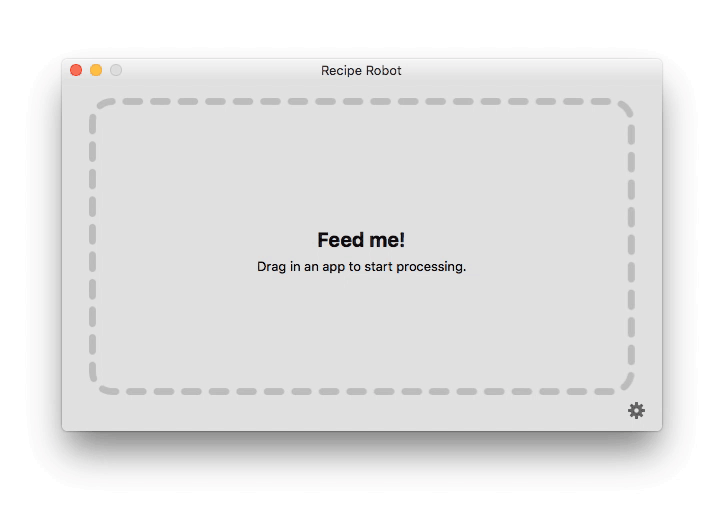
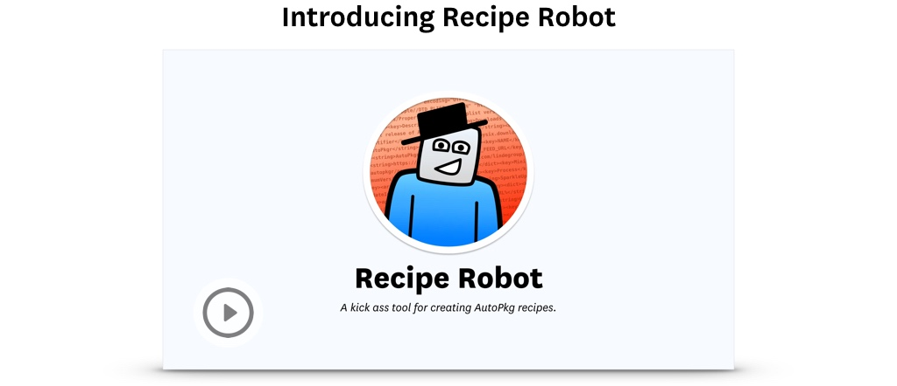
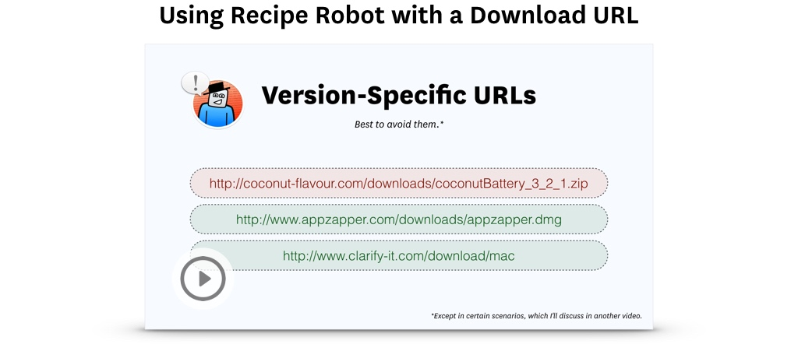
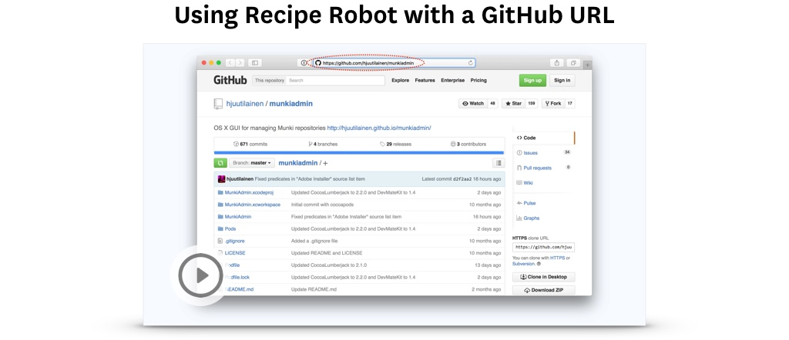
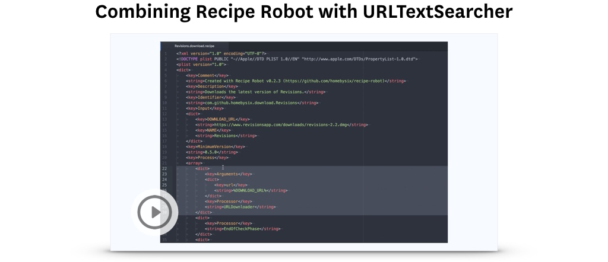
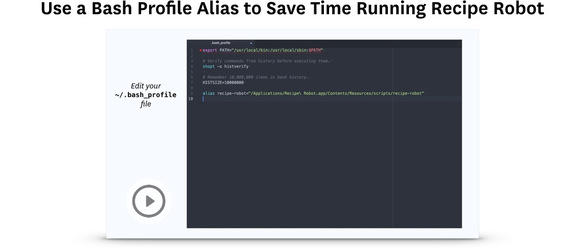
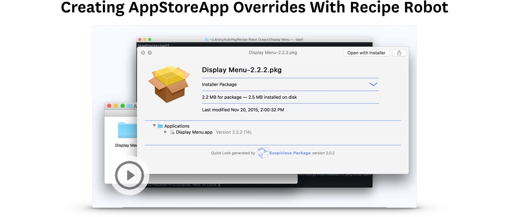
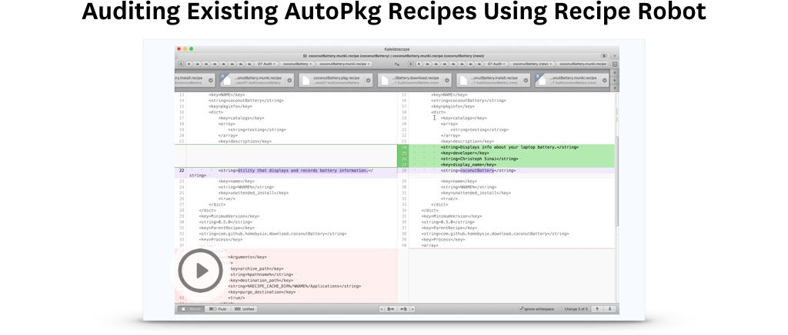

[](#)

<!-- MarkdownTOC autolink=true depth=3 bracket=round -->

- [Overview](#overview)
- [Requirements](#requirements)
- [Mac App Usage](#mac-app-usage)
- [Python Script Usage](#python-script-usage)
- [Video Tutorials](#video-tutorials)
- [Tips](#tips)
    - [Compatibility](#compatibility)
    - [Apps with existing AutoPkg recipes](#apps-with-existing-autopkg-recipes)
    - [Things to tweak in Recipe Robot-produced recipes](#things-to-tweak-in-recipe-robot-produced-recipes)
    - [App Store Apps](#app-store-apps)
- [Troubleshooting](#troubleshooting)
- [Feedback](#feedback)

<!-- /MarkdownTOC -->


## Overview

Recipe Robot is the easiest way to create new AutoPkg recipes for simple Mac apps. It consists of two components:

- A __[Python script](#python-script-usage)__ that takes various types of input and automatically outputs AutoPkg recipes.

- A __[native Mac app](#mac-app-usage)__ that puts a friendly face on the Python script and makes it as simple as dragging and dropping. You can [download the latest version of the app here](https://github.com/homebysix/recipe-robot/releases/latest).

This two-pronged approach allows AutoPkg novices to easily create recipes that follow community-accepted guidelines, and still provides a command-line tool for more advanced AutoPkg users. Also, using Python for program logic fosters community contribution to this project.


## Requirements

In order to run Recipe Robot, you need [AutoPkg](https://github.com/autopkg/autopkg/releases/latest) 0.5.0 or later installed.


## Mac App Usage

You can [download the latest version of the app here](https://github.com/homebysix/recipe-robot/releases/latest).

1. When you first launch the app, you'll be prompted to select the following:

    - Your desired recipe types
    - Your preferred recipe identifier (e.g. com.github.your_name_here)
    - Your recipe output location

    Then click __Good to Go__.

2. Now you're ready to build some recipes! Drag in an app that you want to create recipes for.

    IMPORTANT: The Recipe Robot app currently works best with apps that have a Sparkle feed, and for which there are no existing AutoPkg recipes.

3. You'll see some activity while Recipe Robot processes the app. If no errors are encountered, click __Reveal Recipes__ to see the finished product.

Here's what the whole process looks like:




## Python Script Usage

Recipe Robot's Mac app is designed to be easy to use, but it's the command-line Python script that contains the real horsepower. To use it, just install the latest version of Recipe Robot in your Applications folder, open Terminal, and type:

```
/Applications/Recipe\ Robot.app/Contents/Resources/scripts/recipe-robot <input>
```

For `<input>`, you can use one of several types of information:

- The path to a Mac app.
- The path to a zip, dmg, or pkg installer for a Mac app.
- The URL to an app's Sparkle feed.
- The direct download URL for an app (which usually ends with .zip or .dmg).
- The GitHub, BitBucket, or SourceForge project URL for an app.

The first time Recipe Robot runs, you'll be prompted for some information. On subsequent runs, you can use the `--config` argument to force this prompt to return.

Here's what the Recipe Robot command-line script looks like in action. The command I used was: `/Applications/Recipe\ Robot.app/Contents/Resources/scripts/recipe-robot --verbose /Applications/Mountee.app`


This animation hasn't been sped up. Recipe Robot really is that fast! Most of the time, the longest part of the process is the app download, which will depend on your individual internet connection speed.

I always use `--verbose` mode. It's fun to see the details, and it proves very useful for troubleshooting.


## Video Tutorials

I've produced a series of video tutorials to demonstrate various features of Recipe Robot.

Also see the [Tips](#tips) section below for more timesavers.

[](https://www.youtube.com/watch?v=E531jJLovhc&list=PLK1ZziC_XFWoDnSYU3__WRQCRpXA2fhXq&index=1)

[](https://www.youtube.com/watch?v=JnmLktTdh1s&list=PLK1ZziC_XFWoDnSYU3__WRQCRpXA2fhXq&index=2)

[](https://www.youtube.com/watch?v=ifqv-j45AWU&list=PLK1ZziC_XFWoDnSYU3__WRQCRpXA2fhXq&index=3)

[](https://www.youtube.com/watch?v=3UWKBQWZp3A&list=PLK1ZziC_XFWoDnSYU3__WRQCRpXA2fhXq&index=4)

[](https://www.youtube.com/watch?v=5WF5rl0H3hQ&list=PLK1ZziC_XFWoDnSYU3__WRQCRpXA2fhXq&index=5)

[](https://www.youtube.com/watch?v=dWBPKhMIWZI&list=PLK1ZziC_XFWoDnSYU3__WRQCRpXA2fhXq&index=6)

[](https://www.youtube.com/watch?v=3hn7yNWuUPA&list=PLK1ZziC_XFWoDnSYU3__WRQCRpXA2fhXq&index=7)

[](https://www.youtube.com/watch?v=sItavxHraRQ&list=PLK1ZziC_XFWoDnSYU3__WRQCRpXA2fhXq&index=8)


## Tips

### Compatibility

My goal is _not_ to make Recipe Robot generate perfect recipes 100% of the time. There will be apps that Recipe Robot may not be able to generate recipes for, and some recipe types are more complex to build than others. I hope Recipe Robot will make the process of writing recipes for _simple_ apps much faster and more consistent. The recipes created by Recipe Robot should serve as a platform that you can customize before using and sharing.

You may still need to make a recipe the old fashioned way, if the Robot comes up empty.

### Apps with existing AutoPkg recipes

By default, Recipe Robot does _not_ generate recipes for an app if any AutoPkg recipes already exist for that app. This is a design choice we made after careful consideration, for two reasons:

1. It's difficult to parse a ParentRecipe and determine exactly which processors will be needed and which file paths we can rely on. Your brain is still the best tool for that.

2. Many AutoPkg recipe authors put a lot of work into creating and maintaining their recipes, and it's important that we respect that by refraining from uploading duplicate recipes to GitHub.

You can override this etiquette, but please only post a duplicate set of recipes to GitHub if they meet these guidelines:

- applicable to a wide audience
- better than the original in at least one significant way
- a note in the description clarifies how your recipe differs (see [this example](https://github.com/autopkg/homebysix-recipes/blob/b3e30cf859e983ff1cf6ad6a053917d17434567f/ObjectiveDevelopment/LaunchBar.download.recipe#L10-L13))

Thank you!

### Things to tweak in Recipe Robot-produced recipes

Each time Recipe Robot produces a batch of recipes for you, I suggest you check a few things before letting the recipes loose in the wild:

- The filename of the recipe and the `NAME` input variable are determined by the name of the app itself. Many apps are suffixed with a version number (e.g. "Delicious Library 3"), and that version number may not be desirable in all cases. You may need to remove the version number from the filename, recipe identifiers, and `ParentRecipe` keys.

- Recipe Robot doesn't currently know the difference between an app installer and a bona fide app. Therefore, certain apps may produce recipes that simply install the app's installer instead of the app itself. When this happens, it's usually pretty obvious because you'll end up with a set of recipes called, for example, `ChronoSync Installer.___.recipe` instead of `ChronoSync.___.recipe`. The download recipe is probably usable, but the others will need significant customization.

- Recipe Robot does its best at determining an app's description for use in Munki and JSS recipes. But it's far from perfect, and it will surprise you with false positives! Always double-check the description before running Munki and JSS recipes or uploading them to GitHub.

- It's fine to use a version-specific URL as input, but be careful that it doesn't result in download recipes that depend upon it. Such recipes will not serve the purpose of downloading the latest version using AutoPkg.

    You may need to try again with a different URL (preferably one like `http://foo-app.com/latest` or `http://downloads.pretendco.com/Foo.zip` which doesn't point to a specific version).

    Or you may want to explore using [URLTextSearcher](https://github.com/autopkg/autopkg/wiki/Processor-URLTextSearcher) to determine the latest URL by inspecting the source of the developer's download page.

### App Store Apps

If you provide Recipe Robot with the path to an app that came from the Mac App Store, it will create an override for use with Nick McSpadden's [AppStoreApp recipes](https://github.com/autopkg/nmcspadden-recipes#appstoreapp-recipe). Please see the details in his README for requirements necessary to use these overrides.


## Troubleshooting

- If at first you don't succeed, try try again! I usually enlist the following steps for creating recipes:

    1. Provide the app itself as input to Recipe Robot.
    2. If that doesn't work, go to the developer's website and see if they provide a static download link (usually ends with .zip or .dmg). Try using that with the Recipe Robot [script](#python-script-usage).
    3. If that still doesn't work, maybe the app has a GitHub or SourceForge project page? Try providing that to the Recipe Robot [script](#python-script-usage).
    4. Still no luck? Write a recipe from scratch like the good old days. It builds character.

- Run again with `--verbose` when errors occur, and you'll usually see why. It's often because Recipe Robot couldn't determine how to download the app.

- If you get Python exceptions while using Recipe Robot, I invite you to [create an issue on GitHub](https://github.com/homebysix/recipe-robot/issues/new) so I can track the problem. Include full traceback plus whatever input (URL, path, etc) you provided when you ran Recipe Robot.

- Due to reasons I'm still learning about, Recipe Robot (and AutoPkg) don't work with certain kinds of SSL. If you see `SSLV3_ALERT_HANDSHAKE_FAILURE` in the traceback message, see the first troubleshooting point above. If none of those steps work, you might be out of luck.


## Feedback

The best way to get in touch is by opening an [issue](https://github.com/homebysix/recipe-robot/issues) on GitHub.
